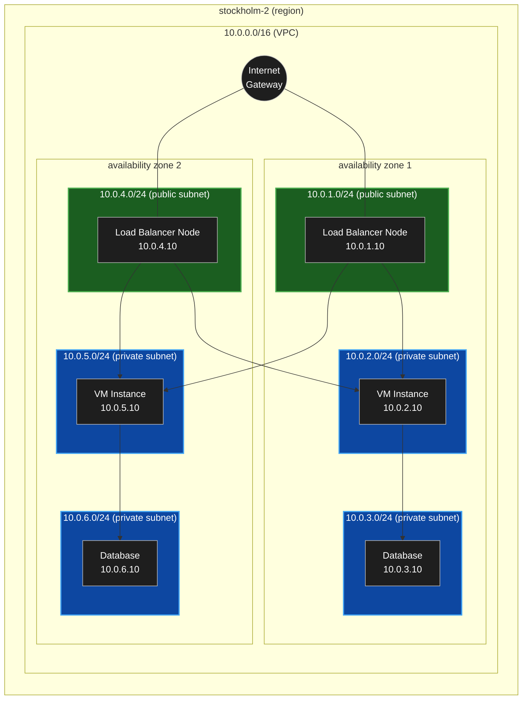

# Virtual Private Cloud

A VPC is an isolated virtual network inside a public cloud provider where you can deploy and manage your own infrastructure.

## What You Can Configure

Inside a VPC, you can configure:

- Virtual machines / servers
- Route tables
- Internet gateways
- Subnets
- Security groups / firewall rules
- Load balancers
- Private and public networking

## Subnets

A VPC can contain multiple subnets.

- **Public subnets**
    - Accessible from the internet
    - Usually contain load balancers, NAT gateways, or bastion hosts

- **Private subnets**
    - Not directly accessible from the internet
    - Usually contain application servers and databases

- Configure IPv4 adress range
    - example:
        - 10.0.0.0/8 — large network (millions of IP addresses)
        - 10.0.0.0/16 — medium network (65,536 IP addresses)
        - 10.0.0.0/24 — small network (256 IP addresses)
