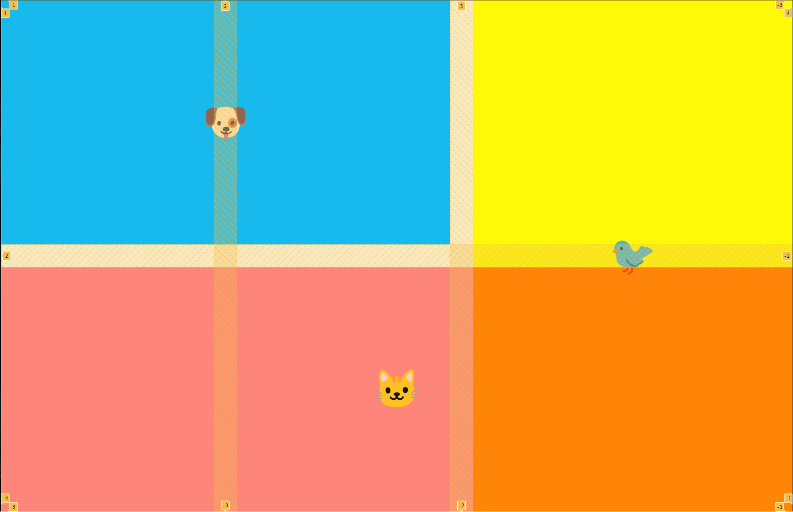
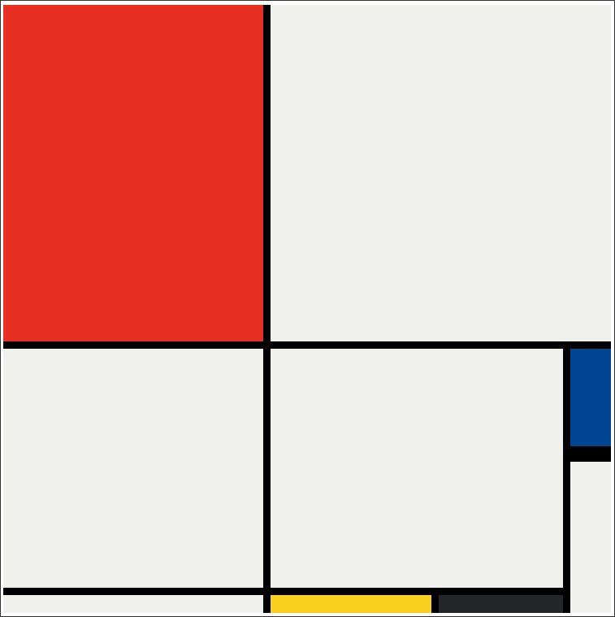

# Grid

## Grid Placement

### Output View



### Code View

```html
<!DOCTYPE html>
<html>

<head>
  <meta charset="UTF-8">
  <meta name="viewport" content="width=device-width, initial-scale=1.0">
  <title>Grid Placement</title>
  <style>
    body {
      padding: 0;
      margin: 0;
    }

    .container {
      height: 100vh;
      display: grid;
      gap: 3rem;
      grid-template-columns: 1fr 1fr 1.5fr;
      grid-template-rows: 1fr 1fr;
    }

    .item {
      font-size: 5rem;
      color: white;
      font-family: Arial, Helvetica, sans-serif;
      background-color: blueviolet;
      display: flex;
      align-items: center;
      justify-content: center;

    }
    .dog {
      background-color: #00B9FF;
      grid-column: span 2;
    }
    .bird {
      background-color: yellow;
      grid-area: 1 / 3 / -1 / 4;
    }
    .cat {
      background-color: #ff000080;
      order: 1;
      grid-area: 2 / 1 / 3 / 4;
    }
  </style>
</head>

<body>
  <div class="container">
    <div class="item dog">🐶</div>
    <div class="item cat">🐱</div>
    <div class="item bird">🐦</div>
  </div>
</body>

</html>
```

Grid line diagram:

```diagram
1   2   3   4
|---|---|---|
| A | B | C |
|---|---|---|
| D | E | F |
|---|---|---|
```

- Explanation
    - dog -> A and B
    - bird -> C and F
    - cat -> D E F

- `span 2`
    - means the element spans two columns.

- `fr`
    - represents a fraction of the available space in the grid container.


- `grid-column`
    - controls horizontal placement in the grid

- `grid-row`
    - controls vertical placement in the grid

- `grid-area`

Syntax:

grid-area: row-start / column-start / row-end / column-end;

Example:

```html
grid-area: 1 / 3 / -1 / 4;
```

## Grid Placement Advanced

### Output View



### Code View

```html
<!DOCTYPE html>
<html lang="en">

<head>
  <meta charset="UTF-8">
  <meta name="viewport" content="width=device-width, initial-scale=1.0">
  <title>Mondrian Painting Project</title>
  <style>
    body {
      display: flex;
      justify-content: center;
      align-items: center;
      height: 100vh;
    }
    .container {
      height: 748px;
      width: 748px;
      display: grid;
      grid-template-columns: 320px 198px 153px 50px;
      grid-template-rows: 414px 130px 155px 22px;
      background-color: black;
      gap: 9px;
    }
    .item {
      background-color: #F0F1EC;
    }
    .left_up {
      background-color: #E72F24;
    }
    .middle_left {
      grid-column: span 3;
    }
    .down_left {
      grid-row: span 2;
    }
    .middle {
      grid-area: 2 / 2 / 4 / 4;
    }
    .middle_up_right {
      background-color: #004592;
      border-bottom: 10px solid black;
    }
    .middle_down_1 {
      background-color: #F9D01E;
    }
    .middle_down_2 {
      background-color: #232629;
    }

    .down_right {
      grid-row: span 2;
    }
  </style>
</head>

<body>
  <div class="container">
    <div class="item left_up"></div>
    <div class="item middle_left"></div>
    <div class="item down_left"></div>
    <div class="item middle"></div>
    <div class="item middle_up_right"></div>
    <div class="item down_right"></div>
    <div class="item middle_right"></div>
    <div class="item middle_down_1"></div>
    <div class="item middle_down_2"></div>
  </div>
</body>

</html>
```
