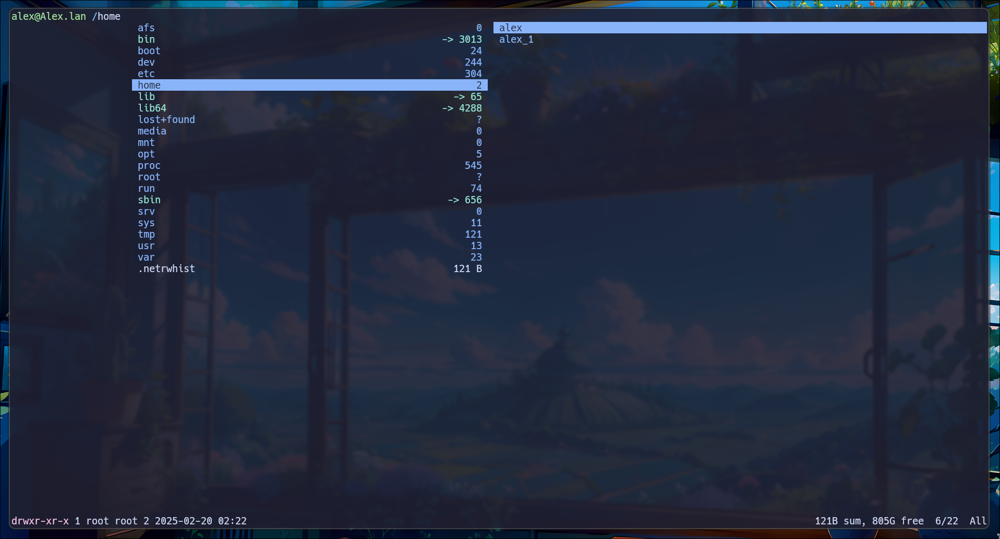

# Hyprland INFO & TIPS

## General Config

```
nvim .config/hypr/hyprland.conf
hyprctl reload
```

## Waybar


```
nvim ~/.config/waybar/ .
```

[Style Examples](https://github.com/Alexays/Waybar/wiki/Examples)

## Monitors


```
nvim .config/hypr/hyprland.conf
```
```
# Get positions:
hyprctl monitors
```
```
# See https://wiki.hyprland.org/Configuring/Monitors/
#monitor=,preferred,auto,auto
monitor=HDMI-A-6, 1920x1080, 0x0, 1 # Left
monitor=DP-4, 1920x1080, 1920x0, 1  # Middle
monitor=DP-3, 1920x1080, 3840x0, 1  # Right
```

## App Launcher

### Chose you app starter [here](https://wiki.hypr.land/Useful-Utilities/App-Launchers/)

I'm using [Wofi](https://hg.sr.ht/~scoopta/wofi)

### Install Wofi

```
dnf install wofi
```

Add a Wofi flavour example: https://github.com/quantumfate/wofi

Apply flavour to style.css:

```
nvim ~/.config/wofi/style.css
```

Add keybind for hyprland:

```
nvim .config/hypr/hyprland.conf
```
```
### MY PROGRAMS ###
$menu = wofi --show drun
### KEYBINDINGS ###
bind = $mainMod, E, exec, $menu
```

## Default App Entry

### Nvim example (how to set text/plain apps to nvim)

```
nvim ~/.local/share/applications/nvim-terminal.desktop
```

```
[Desktop Entry]
Name=Neovim (Terminal)
Exec=kitty -e nvim %f
Type=Application
MimeType=text/plain;
```

```
xdg-mime default nvim-terminal.desktop text/plain
```

## Volume

### Test command:

```
amixer set Master 70%,18%
```

### Add conf to hyprland.conf:

```
exec-once = amixer set Master 70%,18%
```

## File Manager TUI



```
sudo dnf install ranger
```
```
nvim .config/hypr/hyprland.conf
```
```
ranger
```
```
$fileManager = kitty ranger
```
```
ranger --copy-config=all # Optional
```
```
nvim ~/.config/ranger/rc.conf
```
```
# Find each var in config file and the value:
set show_hidden true
set preview_images true
set preview_images_method kitty
```
```
# Make sure this is added
export EDITOR='nvim' # This is required to use neovim as EDITOR in Ranger
# Add to sys-wide-var file (not hyprland or .bashrc config because it will not work):
# !Warning: check command before you apply!
echo 'EDITOR=nvim' >> /etc/environment # apply system-wide var since adding var to .bashrc will not work
```
