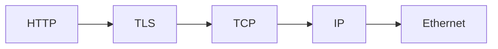
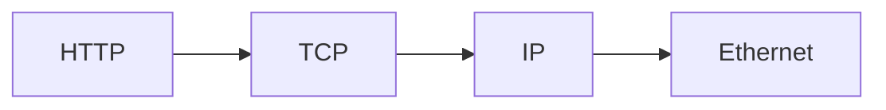
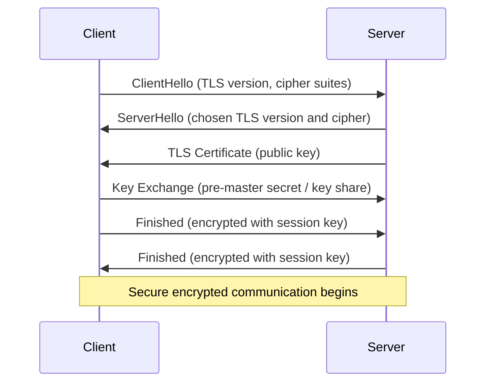

# HTTPS

## What is TLS

- Transport Layer Security (TLS) is a cryptographic protocol used to secure communication over a network such as the Internet.
- HTTPS = HTTP + TLS
    - HTTPS is HTTP running over TLS. It encrypts HTTP communication between the client and the server.

With TLS:

Without TLS:

- IPsec is another protocol used to encrypt network traffic at the IP layer, but it is not always supported or configured on all networks/routers.
- To secure HTTP traffic, it must be encrypted with TLS.

## Technical Overview

- TLS is a cryptographic protocol between two parties that defines rules for secure communication and message structure.
- Cipher suites
    - Cipher suites define the algorithms used for key exchange, authentication, and encryption.
    - Cipher suites have changed over time because older cryptographic algorithms are no longer considered secure.
    - Modern TLS implementations use AEAD (Authenticated Encryption with Associated Data) algorithms such as AES-GCM or ChaCha20-Poly1305.
- The TLS message structure is fixed
    - It does not matter which programming language the web server is written in.

## Security

- SSL (versions 2.0 and 3.0) is deprecated due to severe security vulnerabilities.

- TLS is the modern standard used to secure HTTPS connections.

TLS uses two types of cryptography:

- Public-key cryptography is used during the handshake to securely exchange keys.
- Symmetric encryption (session keys) is used after the handshake for fast encrypted communication.
- Message authentication ensures that data has not been modified in transit.

- TLS protects against several types of attacks, including man-in-the-middle, replay, and downgrade attacks.
- TLS 1.2 typically requires two round trips between the client and server to complete the handshake.
- TLS 1.3 reduces the handshake to one round trip (1-RTT), improving connection latency.

## Certificate

To establish a secure HTTPS connection, a TLS certificate must be installed on the server or infrastructure component that terminates the TLS connection (for example a web server, reverse proxy, load balancer, or CDN). A TLS certificate is issued by a certificate authority to a person or organization that owns the domain. The certificate contains information about the domain owner and the server's public key, which clients use to verify the server's identity.

## TLS Handshake

The TLS handshake is the initial phase of establishing a secure TLS connection between a client (such as a web browser) and a web server.

During the TLS handshake, the client and web server perform several steps to establish a secure communication channel:

- Negotiate the TLS version that will be used (for example, TLS 1.2 or TLS 1.3).
- Select a cipher suite, which defines the cryptographic algorithms used for encryption and authentication.
- Authenticate the server's identity using its TLS certificate, which is validated by the client.
- Establish shared session keys used to encrypt and secure all communication after the handshake is complete.

Once the handshake is finished, all communication between the client and server is encrypted and securely transmitted.

## History - How SSL became TLS

- [TLS - Video](https://www.youtube.com/watch?v=0TLDTodL7Lc)

## How to Install TLS

### 1. TLS on a Web Server using Let's Encrypt

- [Nginx + Certbot](https://certbot.eff.org/instructions?ws=nginx&os=pip)

- [Apache HTTP Server + Certbot](https://certbot.eff.org/instructions?ws=apache&os=pip)

### 2. Cloud-Managed TLS (Cloud Load Balancers)

Examples:

- Amazon Web Services — [AWS Certificate Manager](https://aws.amazon.com/certificate-manager/)
- Google Cloud — [Managed SSL Certificates](https://docs.cloud.google.com/load-balancing/docs/ssl-certificates/google-managed-certs)
- Microsoft — [Azure App Service / Azure Front Door](https://learn.microsoft.com/en-us/azure/app-service/overview-tls)

### Other Methods

- TLS on a reverse proxy
- TLS on a load balancer
- TLS on a CDN edge
- TLS on an ingress controller

## Online Sources

- [TLS - Text - CloudFlare](https://www.cloudflare.com/en-gb/learning/ssl/transport-layer-security-tls/)
- [Handshake - Video](https://youtu.be/86cQJ0MMses)
